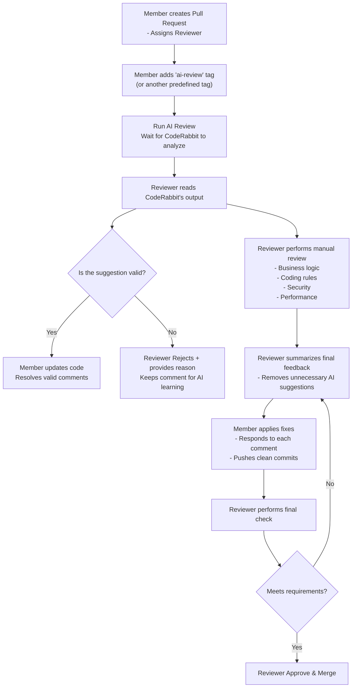

# Guidelines for Using CodeRabbit and General Review Rules

These guidelines explain how to use CodeRabbit effectively during code reviews, along with the general rules all members must follow.

**Audience**: Reviewers and Members.

## 1. Introduction to CodeRabbit

CodeRabbit is an AI-powered automated code review tool that analyzes changes in Pull Requests (PRs) and provides comments to help improve code quality.

It can:

- Detect syntax, logic, and security issues.
- Suggest performance optimizations.
- Check compliance with coding rules defined in files such as `.coderabbit.yaml` and `CODING_STANDARDS.md`.
- Propose refactoring to improve readability and maintainability.

**Important note:**
CodeRabbit is a supporting tool — the final decision always belongs to the reviewer.

## 2. General Rules When Using CodeRabbit

### 2.1 Read and evaluate independently

- Reviewers must understand the code and the changes before reading CodeRabbit's suggestions.
- Do not rely entirely on AI.
- CodeRabbit may sometimes produce inaccurate suggestions → reviewers must prioritize team/project rules.

### 2.2 How to handle CodeRabbit comments

- If a suggestion is valid → update the code, then **Resolve conversation**.
- If a suggestion is not appropriate → provide a short, clear explanation so CodeRabbit can "learn" and adjust future reviews.
- Discuss directly in the PR when necessary.

### 2.3 Rules for Members

- **Must** carefully verify code before pushing (hard-coded credentials, sensitive configs, etc.).
- **Should not** modify code solely based on CodeRabbit's suggestions unless approved by the reviewer.
- May ask questions directly to CodeRabbit, but **must not** provide incorrect or misleading information about the project or coding rules — doing so will cause inaccurate reviews later.

### 2.4 Rules for Reviewers

- Reviewers must filter out unnecessary or irrelevant suggestions.
- Feedback to AI must be clear and concise. Examples:
  - Not recommended: "This review is wrong."
  - Recommended: "Variable name does not follow our camelCase convention."
- Carefully check areas that AI may miss (business logic, edge cases, security, etc.).
- If CodeRabbit repeatedly gives incorrect suggestions, consider updating .coderabbit.yaml.

### 3. Pull Request Review Flow Using CodeRabbit

